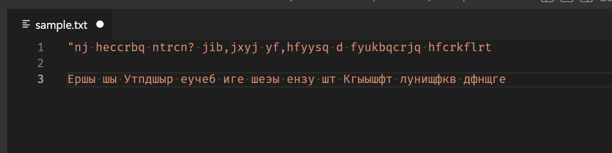

# transcribe README

*Transcribe* Visual Studio Code extension.

Расширение предназначено для исправления ошибочной кодировки (RUS/ENG) "йцукен"<->"qwerty" выделенного фрагмента текста (как PuntoSwitcher, Keyboard Ninja)

## Features

Расширение добавляет команду `Transcribe selected text`, которая «исправит» раскладку клавиатуры.

### Features and restrictions/limitations

- Исправление раскладки только русская<->английская
- Только классическая раскладка йцукен/qwerty
- Направление исправления определяется автоматически

## Requirements

- VSCode minimum version 1.74.0

## Extension Settings

No any settings for now.

## Known Issues

Extension uses very primitive and dumb algorithm to detect selected text 'language' (keyboard layout). It's just two sums of characters (actually codepoints) of selected text: in Latin (0x0020…0x007f) and Cyrillic (0x0400…0x04ff). If there are more Cyrillic characters – we will convert `йцукен` → `qwerty` and vice versa.

There is only one, hardcoded Latin-Cyrillic key map.

## Release Notes

First release. For internal alpha test

### 1.0.0

Initial release.

**Enjoy!**
